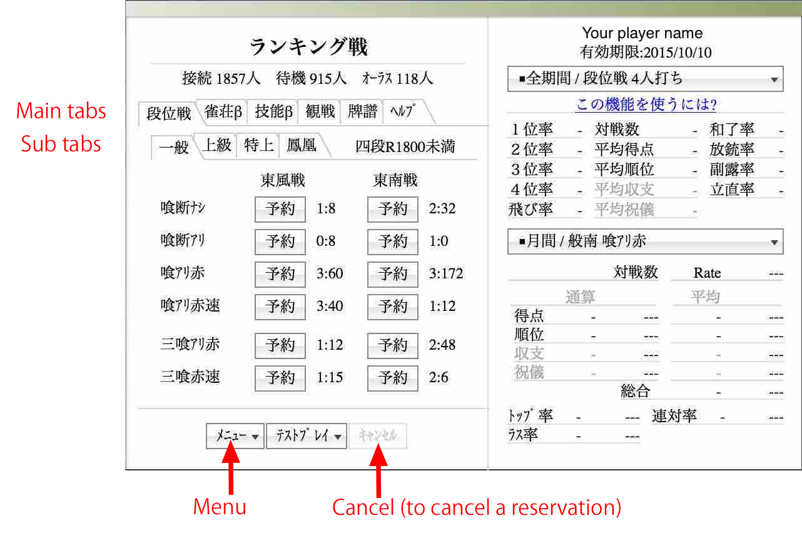
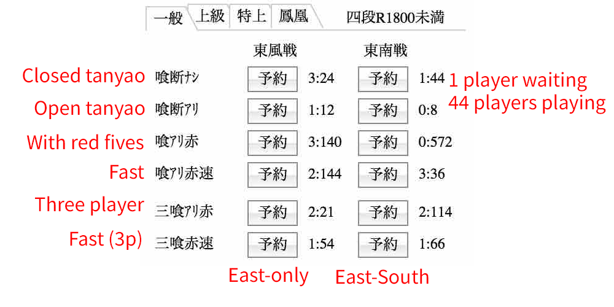

# 1.3 The main page

Here is what the Tenhou main page looks like when you first log on in. The right half of the main page shows your statistics (currently all the fields are blank because you haven’t played any games), and the left half shows the games you can play and some other features.

In the second line of the left hand side, you see three numbers. In the example above, they are 1857, 915, and 118 (the numbers will be different on your screen). These numbers show that 1857 players are currently online, 915 players are waiting, and 118 players are about to finish their games.

Below these three numbers, there are six main tabs, which read 段 位戦, 雀荘β, 技能β, 観戦, 牌譜, and ヘルプ. The 段位戦tab is the main lobby where we play games (段位戦reads dan-i-sen in Japanese; it means ranking matches). Under the 段位戦tab, there are four sub tabs, which read 一般, 上級, 特上, and 鳳凰, corresponding to four different rooms. At first you can only play at tables in the 一般 room. Let’s first go to the 段位戦 tab, and choose the 一般 sub tab.

## Making reservations

In each of the four rooms (i.e., 一 般, 上 級, 特 上, and 鳳 凰), there are 12 different variants of riichi mahjong games you can choose from.

Games in the left column (under 東風戦 tonpusen) are East-only games,[^1] and games in the right column (under 東 南 戦 tonnansen) are more standard East-South games that have both East and South rounds.[^2]

Games in the first row (喰断ナシ kuitan nashi) are unusual games where open tanyao (All Simples) is not allowed; you have to have a concealed hand to claim tanyao. [^3]

There are no red fives in these games, either. Open tanyao is allowed in all the other games. Games in the second row are more standard games with open tanyao, but they do not have red fives. Games in the third row have three red fives. This is arguably the most standard type of riichi mahjong game played in Japan as of now. Games in the fourth row have the same rule as those in the third, but the time limit on each action is more strict. Games in the fifth and sixth rows are three-player games, where open tanyao and red fives are both allowed.

The set of numbers delimited by a colon in each cell represent the numbers of players currently waiting and playing the game, respectively. For example, the first row in the left column shows 3:24, which means that 3 players are waiting in queue after signing up for a game, and 24 players are currently playing East-only, closed tanyao games. As it happens, East-South games with red fives are usually the most popular on Tenhou, followed by East-only, fast games.

To sign up for a game, click on the 予約 (reservation) button in the corresponding cell. You can make as many reservations as you want; you will be given a seat at a table that first becomes available. If you make multiple reservations, other reservations will be automatically canceled when you start playing at another table. To cancel all the reservations at once, click on the キャンセル (Cancel) button at the bottom right of the left-hand side of the main page. The cancel button becomes active (clickable) only after you make a reservation.

## Footnotes

[^1]: In a special circumstance where no player gets 30000 or more points by the end of East-4, the game continues into the South round. 

[^2]: Just like East-only games, when there is no player who has 30000 or more points by the end of South-4, the game continues into the West round. 

[^3]: kuitan means “open tanyao” and kuitan nashi means “without kuitan” in Japanese.