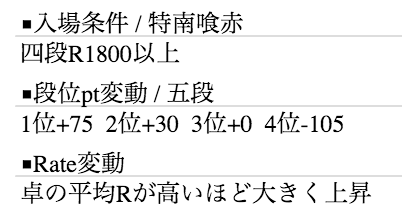
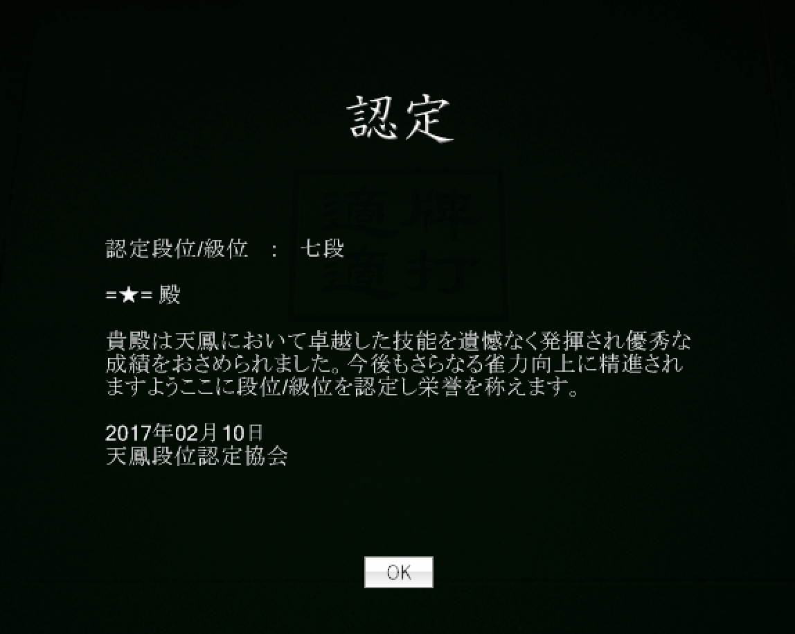

# 2.1 Rank and rating

Tenhou has two different player rating systems — rank (kyu / dan) and R (rate). The kyu / dan ranking system is similar to the one com- monly used in Japanese arts, games, and martial arts. The kyu (級) ranks are shown in arabic numbers, going from 9級 to 1級 in descending order. After passing 1級, you enter the dan (段) ranks, shown in kanji numbers, going from 初段(一段; first dan) to 十段(tenth dan) in ascending order.

Everyone starts with 新人 (newbie; no rank), and if you pass the 十段 rank, you are awarded the highest rank called 天鳳位(Tenhoui). Since the inception of Tenhou in 2006, there have been only nine players who have achieved 天鳳位 at the time of writing this book. Table 2.1 shows the distribution of active players holding each rank as of 20 December, 2015.

Table 2.1: Player distribution

| Rank   | N     | Rank | N      |
|--------|-------|------|--------|
| 天鳳位 | 9     |      |        |
| 十段   | 15    | 1級  | 7780   |
| 九段   | 130   | 2級  | 5849   |
| 八段   | 592   | 3級  | 6481   |
| 七段   | 1830  | 4級  | 6383   |
| 六段   | 3140  | 5級  | 6971   |
| 五段   | 5968  | 6級  | 9964   |
| 四段   | 9957  | 7級  | 16606  |
| 三段   | 14436 | 8級  | 14509  |
| 二段   | 18174 | 9級  | 28283  |
| 初段   | 15046 | 新人 | 132411 |

## 2.2.1 kyu / dan rank
To advance your kyu / dan rank, you need to earn points (called “pt” or “段位pt” on Tenhou). For example, to proceed from the 新 人(newbie) status to the 9 級(kyu) rank, you need to earn 30 points. Required amount of points for promotion gets greater and greater as you move further up. For example, to proceed from 六段 (sixth dan) to 七段 (seventh dan), you need to earn as many as 1200 points.

To find out how many more points you need to earn to advance to the next rank from the current rank, see the top right part of the main page.

In this example, the player currently holds the rank of 7 級. The part that reads “30 / 60 pt” means that he has earned 30 points since he became 7 級 and that he needs 60 points in total to be promoted to 6 級.

When you rise or fall in rank, your points will be reset to a default value. For kyu rank players, the default value is 0 points. For dan rank players, the default value is different depending on ranks. For example, the default points for 六 段 players are 1200 points. When they get 1200 more points and reach 2400 points, they get promoted to 七段. When they lose all the initial 1200 points and reach 0 points, they get demoted to 五段.

The amount of points you earn or lose in each game depends on your placement (but not scores with uma and oka), the type of game (East-only or East–South), the room in which the game is played ( 一 般, 上 級, 特 上, or 鳳 凰), and your current rank.[^1] You gain positive points only if you come in first or second place. If you come in first place, you will gain the following points regardless of your rank.

- 45 points in the 一般 (ippan) room
- 60 points in the 上級 (joukyu) room
- 75 points in the 特上 (tokujou) room
- 90 points in the 鳳凰 (houou) room

If you come in second place, you will gain the following points regardless of your rank.

- 0 points in the 一般 room
- 15 points in the 上級 room
- 30 points in the 特上 room
- 45 points in the 鳳凰 room

You don’t gain or lose points if you come in third place. The points you lose when coming in fourth place depend on your rank but not on the room. When your rank is 3 級 or below, you lose 0 point. However, each time your rank rises above 3 級, the points you lose get bigger by 15 points. That is, 2 級 players lose 15 points if they come in fourth place; 1 級 players lose 15 x 2 = 30 points; 初 段 players lose 15 x 3 = 45 points, ... , and 十段 players lose as many as 180 points if they come in fourth place.

Notice how severe the punishment is for coming in fourth, and it gets more and more severe as your rank goes up. This is one of the distinctive features of Tenhou. Avoiding the fourth place tends to be players’ top priority in Tenhou games. This is in contrast to standard mahjong games, where the reward for coming in first usually outweighs the cost of coming in fourth, thanks to the oka system.[^2]

{ align=right }

To easily find out how many points you earn / lose for each place in a given type of game for your rank, mouseover the 予約 button in each cell on the left-hand side of the main page. Then, you will see something like the picture above on the right-hand side of the main page. Under the second bullet point, we see that, for this player’s rank ( 五段), the point reward is: +75 for first place, +30 for second place, 0 points for third place, and 105 for fourth place.

When you earn enough points for promotion in a game, a new rank is awarded after the game. A certificate message like the picture to the right of this text will pop up after the game.

{ align=right }

Since you never get negative points in games until you reach 2 級 and there is no demotion until you reach 初 段 (first dan), it should be relatively easy to reach 初 段. In fact, even without studying the contents of this book, you can perhaps reach as high as 四 段 (fourth dan) if you play a few hundred games or so. However, moving further up will probably require that you study basic strategies and tile efficiency theories.

## 2.1.2 Rate (R)
In addition to the kyu / dan rank, Tenhou gives each player another rating called R. The initial value of R is 1500, and higher-rank players tend to have a higher R. For example, the average R among the 天鳳位 players is 2248.

While kyu / dan rank remains relatively stable, R can change af- ter each game. R is calculated based on your placement in a game, but it also depends on the average R of the players you play with. A change in R after a game, ∆R, is calculated with the following formula:

$$
\Delta R = (P + R) \times G
$$

where

- $P$ is based on your placement in the game: + 30 for first, +10 for second, - 10 for third, and - 30 for fourth;
- $R$ is an adjustment that reflects how strong your opponents are, calculated as (Average $R$ in the game your $R$) = 40; and
- $G$ is an adjustment based on n, the number of games you have played before. If $n \leq 400$, $G$ is equal to $1 - 0.002 \times n$. If $n > 400$, $G$ is set equal to $0.2$.

R initially fluctuates a lot, as the scaling factor G is very close to 1 until you play many games. R may go up or down by 30 or so for each of the first 100 games or so. As you play more games, however, the fluctuation gets smaller and smaller as G approaches to 0:2.

Notice what the adjustment $\Delta R$ does. This factor is positive when you play against players who are “stronger” than you (i.e., have a higher R than you) while it is negative when you play against players who are “weaker” than you. Therefore, when you win against stronger players, your reward will be bigger than when winning against weaker players. Likewise, when you lose against weaker players, your punishment will be severer than when losing against stronger players. Because of these features, one might say that your R better reflects your skill levels than your kyu / dan rank.

## Footnotes
[^1]: Points you earn or lose in East-only games are two-thirds of those in East–South games.

[^2]: Recall that, although Tenhou does adopt the oka system, it is the placement, not the scores, that determines the points you earn or lose. In this sense, EMA games are actually more similar to Tenhou games than to standard games. Since there is no oka in EMA games, the reward for coming in first is much smaller than that in standard games.