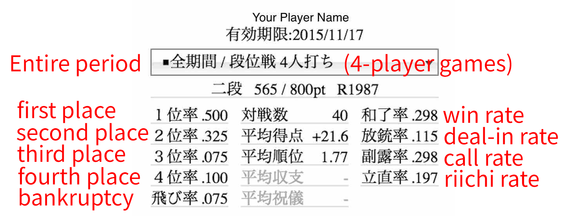
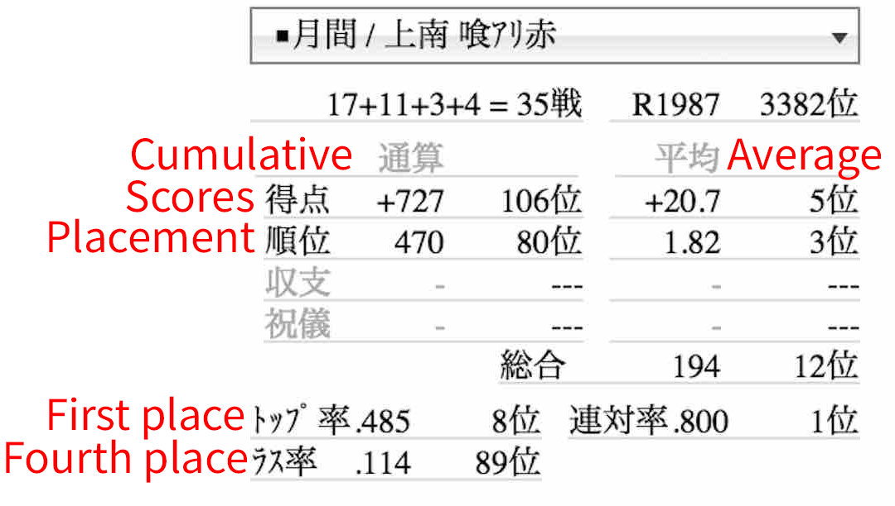

# 2.3 Reading the statistics

After you play 30 games or so, you may want to start paying attention to the statistics shown on the right-hand side of the main page.[^5] The upper half of the player statistics shows your statistics for the entire period, whereas the bottom half shows your statistics in the present month for a given type of game in a given room.

## 2.3.1 Overall statistics

The picture below show my old player statistics (upper half) back from when I had a 二段 rank. Let me explain how to read these statistics.

Below a player name is the expiration date of my premium mem- bership (17 November, 2015). When I started playing Tenhou on 17 September, 2015, I bought a 60-day membership so I can play in the joukyu room. If you have just created a Tenhou account, the expiration date will be shown as today’s or tomorrow’s date, since we are given a 1-day premium membership when we open an account. [^6] After a day or two, it will turn into “—-/–/–” meaning that you do not have a premium membership.

The box below the expiration date that reads 全期間 / 段位戦 4 人 打 ち indicates that the statistics below are for the entire period (not just this month) and for 4-player games (not 3-player games). Below that, we see that I had a 二 段 rank, 565 points (the initial 400 points plus 165 points earned after I became 二 段) out of the 800 points I need for promotion, and an R of 1987.

Three columns below these display my statistics. The first col- umn shows my placement rates. I had come in first place 50% of the games, second place 32.5%, third place 7.5%, fourth place 10 %, and gone bankrupt 7.5% of the games. Ideally, you’d want your first place rate to be greater than your second place rate, your second place rate greater than your third place rate, etc.

The middle column provides the following information. First, 対 戦数 shows the number of games you have played. At this point, I had played 40 games. Second, 平 均 得 点 shows the average score (with oka and uma) from all the games I have played. As I said before, this does not influence your R nor rank. Third, 平 均 順 位 shows the average placement. If you have obtained each of the four places equally, the average placement would be $2.5 \left( \frac{1n + 2n + 3n + 4n}{4n} = 2.5 \right)$. Therefore, any values below 2.5 indicate that you are, on average, winning more than losing. The two rows that follow (shown in light gray) are relevant only if you play games in private rooms. Since I have only played ranking matches, they are left blank.

The third column shows my statistics based on hand-level perfor- mance. First, 和了率 (houra rate; agari rate; win rate) is the number of hands you have won divided by the total number of hands you have played in all games.[^7]

Second, 放銃率 (houjuu rate; deal-in rate) is the number of times you have fed the winning tile to an opponent’s hand divided by the total number of hands you have played. You would want this rate to be lower, but keep in mind that (1) sometimes you would be better off dealing into an opponent’s hand to secure your placement, and (2) sometimes you need to discard dangerous tiles (which would increase your deal-in rate, on average) in order to increase the chance of winning your hand (which would increase your win rate, on average). The rule-of-thumb is that the difference between your win rate and deal-in rate (win rate - deal-in rate) should be at least 10 percentage points. That is, if you have a high deal-in rate, you need your win rate to be higher. Likewise, if you have a low deal-in rate, it is OK to have a lower win rate as well.

Third, 副露率 (fuuro rate; call rate) is the number of hands where you have called chii / pon / kan divided by the total number of hands you have played. Finally, 立 直 率 (riichi rate) is the number of riichi calls you made divided by the number of hands you have played.

The ranking page on Tenhou[^8] has a table that summarizes the av- erage values of these statistics among players with different ranks (under the heading that reads 段 位 戦 ４ 人 打 ち 平 均 戦 績). You may want to compare your statistics with the average values among players who share your rank or those who have higher ranks than you do. Figure 2.1 summarizes the average values of hand-level performance statistics for players in different ranks.

We can see some interesting patterns here. The left-hand side panel compares average win rates ( 和 了 率) and deal-in rates ( 放 銃 率) for different ranks. Notice that the average win rate is relatively constant across different ranks; once you pass the 新 人 rank, it stays around 20-22 %.

<figure markdown="span">
  
  <figcaption>Figure 2.1: Average hand-performance statistics</figcaption>
</figure>

Note: These graphs show the hand-performance statistics reported in a table on the
ranking page [https://bit.ly/2H0AF7V](https://bit.ly/2H0AF7V) as of 20 December, 2015.

On the other hand, the average deal-in rate is steadily decreasing after players move from the kyu ranks into the dan ranks. It is around 15% for almost all kyu rank players (except for 新 人 and 1 級), but it keeps going lower and lower as players rise in the dan rank. The fact that high-dan players have lower deal-in rates on average is remarkable, considering that they are facing stronger opponents than low-dan players do. This pattern signifies the importance of defensive skills.

Another interesting thing to notice on the left-hand side panel is that the average scores deteriorate once you move from 2 級 to 1 級 (i.e., average win rate gets lower, and average deal-in rate gets higher).

I can think of two reasons for why this happens. First, 1 級 is where most players start playing in the joukyu (upper-level) room, where average player skills are much higher than those in the ippan (lower-level) room. If a player who belongs to the lower-level room plays in the upper-level room, their performance will necessarily go down, making it look that 1 級 players are worse than 2 級 players even if they are not. Second, if you keep losing as a 初 段 (first dan) player, you get demoted to 1 級 but you will never be demoted to 2 級. This means that 1 級 players might actually be worse than 2 級 players, on average.

The right-hand side panel shows the average call rates ( 副 露 率) and riichi rates ( 立直率) for different ranks. The former is increasing as rank goes up, while the latter is decreasing, but the changes are rather gradual for both rates.

## 2.3.2 Monthly statistics

The bottom-right part of the main page shows monthly statistics from games you have played in a given room. The box is a pulldown menu that lets you choose the room ( 一 般, 上 級, 特 上, 鳳 凰) and game type (East-only, East–South, with or without open tanyao, red fives, etc.). In the example below, the box reads 月間 / 上南 喰 ア リ赤, which means the following: 月間 means monthly, 上 is short for 上級 (joukyu)[^9], 喰アリ赤 means with open tanyao and red fives.

Below the box, you see the raw placement scores. In this example, 17+11+3+4 = 35 戦 means that I have played 35 games this month, and I came in first place in 17 games, second place in 11 games, third place in 3 games, and fourth place in 4 games. R shown here (1987) should be the same as the R you see in the top part. 3382 位 means that R=1987 puts me in 3382nd place among all the active players on Tenhou.

Two columns follow, where the left column shows the monthly cumulative values and the right column shows the monthly average values. In the first row that reads 得 点 shows the monthly cumulative or average scores from 上 南 喰 ア リ 赤 games (after adding oka and uma). In this example, my cumulative score is 727 from the 35 games I played, which puts me in 106th place among players who have played 30 or more 上 南 喰 ア リ 赤 games this month. Similarly, my average score is 20.7 (= 727/35), which puts me in 5th place. Your placement for average scores will not be shown unless you have played 30 or more games of a given type in a given room in a given month.

In the second row that reads 順位 shows cumulative and average placement from games. The cumulative placement is based on placement values (+30, +10, 10, or 30), whereas the average placement is based on raw placement (1, 2, 3, or 4). The 総合 (total) score is the sum of four placements: cumulative 得 点, cumulative 順 位, average 得 点, and average 順 位. In this example, I earn 106th, 80th, 5th, and 3rd places for these scores, so my total score is 106+80+5+3 = 194 (the lower, the better), which puts me in 12th place among all the players who have played 30 or more 上南 喰アリ赤 games this month. At the bottom, you see トップ率 (first place rate), ラス率 (fourth place rate), and 連対率 (first or second place rate) for 上南 喰アリ赤 games this month.

## Footnotes
[^5]: There is really no point in reading too much into the statistics when you have played only a few games; the sample size is too small to be meaningful.

[^6]: You need to have a premium membership to use Tenhou’s Windows client.

[^7]: The denominator includes hands where no one won.

[^8]: [https://bit.ly/2H0AF7V](https://bit.ly/2H0AF7V)

[^9]: Likewise, 般 is short for 一 般 (ippan), 特 is for 特 上 (tokujou), 鳳 is for 鳳凰 (houou).