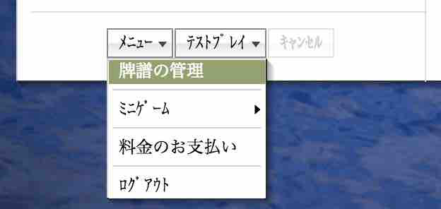

# 2.4 Viewing games

## 2.4.1 Game replay (牌譜)

Tenhou keeps the record of all the games played there, giving each game a unique URL. You can easily take a look at any of the last 40 games you have played on the 牌譜 (haifu; game record) tab on the main page. Click on any of the 牌譜 link shown in the 牌譜 tab to start a replay of the game. You can choose to view the game from any of the four players’ viewpoint, not to show the hands of the other three players, or to go back and forth between turns / hands, etc. When we play mahjong, we often wonder what the opponents are doing (e.g., what are their waits? are they doing honitsu?, etc.). You can find out the answers to these questions after the game by taking a look at the game record.

<figure markdown="span">
    
</figure>

If you would like to have someone take a look at a particular game you played to ask for their opinions, you need to find the unique URL assigned to the game you want to show. You can find out the URLs of the last 40 games by going to the 牌譜の管理 menu from the メニュー pull-down on the main page. Clicking on 牌譜の管理 will open a new pop-up screen.

You can choose to open a game replay in the current window ( こ の ウィン ド ウ で 開 く), in a new pop-up window ( 新 し い ポップ アッ プ で 開 く), or in a new window ( 新 し い ウィン ド ウ で 開 く) from the pull-down menu above. Once you are happy with your choice, click on the 再 生 (replay) link next to the game you want replayed. You will be taken to a page that looks like the one you saw after clicking on the Play button on the top page of Tenhou. You can now find out the URL assigned to the game in the URL field of your browser.

To start a replay, click on a link that reads » Flash 版牌譜ビューアで 開 く shown at the bottom of the page. Clicking on the HTML+JS 版 牌譜ビューアで開く link will also work, but this one is the low-quality picture version with limited options.

## 2.4.2 Spectating games ( 観戦)
You can watch games played in the 特 上 (tokujou; advanced) and the 鳳凰 (houou; phoenix) rooms in quasi-real time (with a fiveminute delay). Click on the 観 戦 (kansen; spectating) tab from the main page and you will see the list of games you can watch. Click on one of the player name links to start spectating the game from the chosen player’s viewpoint.