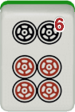
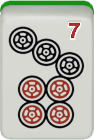
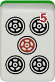
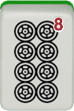
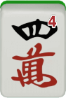

# 3.1 Learning Strategies

Mahjong is a game of skill and luck. There is a set of strategy
principles you can learn to improve your skills, but acquiring skills is
neither necessary nor sufficient to win a game. On the contrary, with
luck, an unskilled player can easily defeat strong players in mahjong.
At least in the short run, game outcomes are governed more by luck
than by skills.[^1] However, learning strategy principles is crucial to
improve your performance in the long run. Moreover, you will be
able to enjoy the game in greater depth once you understand these
principles.

Because of the probabilistic nature of the game, making the best choice does not always lead to the best outcome. The best choices are those that lead to the best outcome, on _average_. An evaluation of our choices thus requires a _probabilistic_ (i.e., statistical) assessment of different options. For example, consider the following hand.

<fieldset class="mahjong-group">

What would you discard?

</fieldset>

This hand becomes ready to win if you discard  or . Let’s compare the two choices.

• Discard   ⇒  you wait for     (2 kinds–8 tiles)

• Discard  ⇒ 
you wait for    (2 kinds–4 tiles)

Which discard choice is better? Although both of the two choices
yield a 2-way wait, waiting for   is much better than waiting
for  , probabilistically speaking. With the   wait, there are
four tiles of  and another four tiles of  to win on, leaving at most
eight winning tiles.[^2] With the   wait, on the other hand, you
have already used up two tiles of  and two tiles of  yourself,
leaving at most four winning tiles. It is clearly better to choose the
  wait over the   wait, because that will give you a higher
probability of winning this hand.

It is possible that, after you decided on the   wait, your opponents end up not discarding  or  at all, while discarding lots of
 . This is the kind of thing that will happen often in mahjong (or
in any game of luck, for that matter). When things like this happen,
do not think that you made a bad call; you didn’t. You made the right
choice, but you were just unlucky. When we experience this kind of
bad luck, we just need to keep calm and carry on.

Before discussing a practical method of maximizing tile efficiency in the next chapter, I will discuss some basic principles of tile efficiency in this chapter. In doing so, I introduce several key terms we use in later chapters. I will also provide the original Japanese term for each (shown in this font). I do so because you may find these Japanese terms used in some online strategy discussions in English.

## Footnotes
[^1]: An interesting question would be: how short is the “short” run here. That is, how many games do we need in order to discern a strong player from weak players? Studies show that we would need at least 100 games or so to have a reliable estimate of our skill levels. Given that EMA tournaments usually have only 8 games, winning at these tournaments requires quite a bit of luck.

[^2]: Of course, the number of winning tiles could be smaller than eight if some of them have already been discarded.
