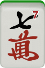
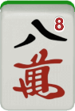
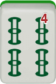
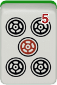
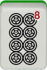
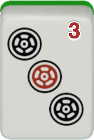
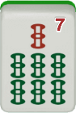
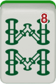
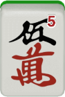
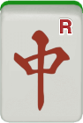

# 3.2 Basic building blocks

## Tiles
Mahjong tiles can be classified into two categories — number tiles and honor tiles.

<fieldset class="honor-tiles">
  <legend>Number tiles</legend>

  

    

      <strong>Cracks (characters)</strong> <em>Manzu</em>
    

    

      <!-- Replace with your actual tile images -->
      
      
      
      
      
      
      
      
      
    

  

  

    

      <strong>Dots (circles)</strong> <em>Pinzu</em>
    

    

      <!-- Replace with your actual tile images -->
      
      
      
      
      
      
      
      
      
    

  

  

    

      <strong>Bamboos</strong> <em>Souzu</em>
    

    

      <!-- Replace with your actual tile images -->
      
      
      
      
      
      
      
      
      
    

  

</fieldset>

We further classify number tiles into simples (tanyao hai; tiles between 2 and 8) and terminals (yaochu hai; 1 and 9). They are differentiated because they serve different yaku and generate different minipoints (fu).

It has become quite common to include some red five tiles. For example, most games on Tenhou have one red five tile in each suit,

 . These tiles are included in place of regular fives; we have three regular fives and one red five in each suit. Red fives are treated as dora regardless of the dora indicator. When a 4 in a given suit is the dora indicator, the red five in that suit will be a double dora tile.

<fieldset class="honor-tiles">
  <legend>Honor tiles</legend>
    <table class="tile-table">
    <tbody>
        <tr>
        <td class="category">Dragon tiles</td>
        <td class="tile">
     
            White (<i>haku</i>)
        </td>
        <td class="tile">
     
            Green (<i>hatsu</i>)
        </td>
        <td class="tile">
     
            Red (<i>chun</i>)
        </td>
        </tr>
        <tr>
        <td colspan="4" class="spacer"></td>
        </tr>
        <tr>
        <td class="category">Wind tiles</td>
        <td class="tile">
     
            East (<i>ton</i>)
        </td>
        <td class="tile">
     
            South (<i>nan</i>)
        </td>
        <td class="tile">
     
            West (<i>sha</i>)
        </td>
        <td class="tile">
     
            North (<i>pei</i>)
        </td>
        </tr>
    </tbody>
    </table>
</fieldset>

Some honor tiles are **value tiles** (fanpai / yakuhai); we get one han if we collect three identical value tiles. All dragon tiles are value tiles regardless of the round and seating. On the other hand, the value status of wind tiles depends on the round and the seating. East tiles are value tiles for everyone during the East round, and South tiles are value tiles for everyone during the South round. In addition, each player gets their own seating wind as a value tile. For example, West tiles are value tiles only for the West player, but they are valueless wind tiles (otakaze) for other players.

## 3.2.2 Group (mentsu)
One of the major goals in playing mahjong is to win a hand. [^3] To win a standard hand, we need to complete four groups (mentsu) and one head (atama; final pair). [^4] Groups can be classified into two kinds — run and set. [^5]

- Run (shuntsu; chow / sequence) is a set of three consecutive
number tiles: e.g., , 

- Set (kotsu; pung / triplet) is a set of three identical tiles: e.g.,
, .
[^6]

## 3.2.3 Ready and n-away
We say a hand is **ready** (tenpai) when the hand can be complete with one more tile. For example, the following hand is ready. 

<fieldset class="mahjong-group">
  <legend>Ready hand</legend>

</fieldset>

This hand becomes complete with either  or . We say that this
hand waits for  .

We say a hand is **1-away from ready**(1-shanten) when the hand can become ready with one more tile. For example, the following hand is 1-away from ready.

<fieldset class="mahjong-group">
  <legend>1-away hand</legend>

</fieldset>

This hand becomes ready if you draw any of          . We say this hand accepts           (5 kinds–16 tiles) as any of them can make this hand advance from 1-away to ready. Tile acceptance (ukeire) refers to the kinds and the number of tiles a hand can accept. Other things being equal, having a 1-away hand with greater tile acceptance is better than having one with smaller tile acceptance.

More generally, we say a hand is *n-away* from ready (*n-shanten*) when the hand can be ready with n more steps. For example, the following hand is 2-away from ready.

<fieldset class="mahjong-group">
  <legend>2-away hand</legend>

</fieldset>

This hand accepts all the tiles that the 1-away hand above accepts (        ), plus seven additional kinds of tiles               [^7]. The hand will become 1-away if any of these tiles gets drawn.

A hand can also be 3-away, 4-away, 5-away, or 6-away from ready. [^8] In practice, however, there is not much point in distinguishing 3away hands from 4-away (or worse) hands. You thus need to be able to distinguish between four kinds of hands — ready hands, 1-away hands, 2-away hands, and 3-away or worse hands.

### Tile acceptance shrinkage

As *n* gets smaller and the hand gets closer to completion, the kinds and the number of tiles it can accept will necessarily get smaller. Consider the three stages of a hand we have seen above.

- When 2-away, it accepts:  
                      .  

- When 1-away, it accepts:  
       .  

- When ready, it waits for:  
  .

Tile acceptance is minimized when the hand is ready. Note also that it is *virtually* minimized when it is 1-away. This is because with a ready hand you can utilize not only the tiles you draw but also the tiles discarded by others to complete the hand. With n-away hands, however, you have to rely (almost) solely on the tiles you draw yourself to advance your hand.[^9] Therefore, in choosing a discard from a 2-away hand, we should try not to make for a 1-away hand with too small tile acceptance.

### Advancing your hand

To win a hand, we need to advance our hand by reducing the n of an n-away hand until it is ready. When a hand is 2-away, we should aim to make the hand 1-away. When a hand is 1-away, we should aim to make the hand ready. For example, consider the following hand.

<fieldset class="mahjong-group">
  <legend>2-away vs. 1-away</legend>

What would you discard?

</fieldset>

Discarding  makes the hand 2-away, whereas discarding either   or  makes the hand 1-away. You should thus discard  or  to  make the hand 1-away. Reverting a 1-away hand to 2-away makes  sense only in some exceptional cases where tile acceptance at 1-away  becomes unbearably small (i.e., fewer than 2 kinds). With this hand,  the hand will be able to accept  (3 kinds–12 tiles) when it  becomes 1-away.

## 3.2.4 Protoruns (taatsu)
Of the two kinds of groups, it is easier to complete a run than to complete a set. There are only four identical tiles, and completing a set requires that you collect three out of the four identical tiles. Therefore, we usually prioritize runs over sets in advancing a hand.

A pair of tiles that can become a run with one more tile is called a **protorun** (taatsu). There are three types of protoruns, summarized in Table 3.1.

Table 3.1: Types of protoruns

| Name        | Japanese   | Example                                                                 | Wait                                     | Acceptance       |
|-------------|------------|--------------------------------------------------------------------------|------------------------------------------|------------------|
| side wait   | *ryanmen*  |   |   | 2 kinds–8 tiles  |
| closed wait | *kanchan*  |   |               | 1 kind–4 tiles   |
| edge wait   | *penchan*  |   |               | 1 kind–4 tiles   |

As we can see in the table, a **side-wait** (ryanmen) protorun can accept twice as many tiles as a **closed-wait** (kanchan) protorun or an **edge-wait** (penchan) protorun can. Therefore, building side-wait protoruns is the key to advancing a hand. Winning tiles of side-wait protoruns are often denoted with a hyphen in the middle, such as - or -. [^10]

### Closed wait vs. edge wait

There is no difference in the kinds and the number of tiles accepted by closed-wait and edge-wait protoruns; they both accept 1 kind–4 tiles. However, closed-wait protoruns are superior to edgewait ones because they can more easily evolve into a side-wait protorun.

A closed-wait protorun can evolve into a side-wait protorun in  just one step. For example, a protorun   can become a side-wait one if you draw  and discard .  

<fieldset class="no-border">

  
   
  ⇒ 
   
  

draw 

</fieldset>

On the other hand, it requires two steps for an edge-wait protorun to  evolve into a side-wait protorun. For example, a protorun  can become a side-wait one if you draw  first and then .  

<fieldset class="no-border">

        
            ⇒
            

                draw 
            

        

        
            ⇒
            

                draw 
            

        

</fieldset>

<fieldset class="redline">
  <legend>Value ranking of protoruns</legend>

side wait > closed wait > edge wait

</fieldset>

### Tile versatility

Some tiles are more versatile than others. For example, number tiles are more versatile than honor tiles because honor tiles can never form a run. Moreover, we can rank order the versatility of number tiles based on the types of protoruns they can form.

Number tiles between 3 and 7 are the most versatile. This is because each of them can form a protorun with four kinds of number tiles. For example,  can form a protorun with , , , and . Two out of the four resulting protoruns will be side wait.

2 and 8 are less versatile. They can form a protorun with only three kinds of number tiles. For example,  can form a protorun with , , and . Only one out of the three resulting protoruns is side wait.

Terminals (1 and 9) are the least versatile. They can form a protorun with only two kinds of tiles. For example,  can form a protorun only with  and . Neither of the two resulting protoruns is side wait.

<fieldset class="redline">
  <legend>Versatility ranking of tiles</legend>

3–7 tiles > 2, 8 tiles > 1, 9 tiles > honor tiles

</fieldset>

Applying the same logic, we can also rank order the versatility of closed-wait protoruns. For example, a closed-wait protorun  can become a side-wait one only if we draw . Likewise, a closed-wait protorun  can become a side-wait one only if we draw .

However, a closed-wait protorun  can become a side-wait one if we draw  or . Clearly,  is more versatile than  or .

<fieldset class="redline">
  <legend>Versatility ranking of closed-wait protoruns</legend>

35, 46, 57 > 13, 24, 68, 79

</fieldset>

## 3.2.5 Pairs (toitsu)
A set of two identical tiles is called a **pair** (toitsu). Pairs can perform
several different roles. A pair can be the head (final pair) of a
hand, a protoset (a candidate for a set), or a component of chiitoitsu
(Seven Pairs).

### Building the head

Any hand — including Thirteen Orphans and Seven Pairs — requires
the head to be complete. Since building the head is much easier
than building a group, we usually don’t worry too much about
the head. For example, consider the following hand.

<fieldset class="mahjong-group">
  <legend>Hand with no head</legend>

</fieldset>

This hand currently lacks the head and the wait is not very good. The hand is complete only with  (1 kind–3 tiles). However, if we draw any of:                          (12 kinds–41 tiles), the wait will be significantly improved. For example, if we draw  and  discard , the hand becomes:

This hand is now waiting for     —   (3 kinds–9 tiles). When a hand is missing the head, it is often the case that the wait gets significantly improved quite easily.

## 3.2.6 Pairs and sets
Another important role a pair can play is to work as a candidate for a set. Especially when a hand has two pairs, we can count on one of the two pairs to become the head while the other becomes a set. In other words, the value of pairs is maximized when there are two (and only two) pairs in a hand. Let’s see why this is the case by comparing hands with one, two, and three pairs.

<fieldset class="mahjong-group">
  <legend>1. Hand with one pair</legend>

</fieldset>

This 2-away hand has one pair: . This pair is not very useful as  a candidate for a set for two reasons. First, if we draw another ,  we will complete a set but then we will lose the head at the same  time. The hand will still be 2-away from ready after all. Second, the  probability of drawing another  is not very high because there are  only two tiles left.

What if a hand has two pairs? Suppose we drew  and discarded  , as follows.

<fieldset class="mahjong-group">
  <legend>2. Hand with two pairs</legend>

</fieldset>

This hand is also 2-away, but it has two pairs:  and . Each  of these pairs is now functioning as an effective candidate for a set.  Whenever one pair becomes a set, the other pair becomes the head.  Drawing  or  will advance this hand from 2-away to 1-away.

Moreover, whereas the hand with one pair was able to accept two  tiles of , the hand with two pairs can accept four tiles (two of   and two of ). The probability of drawing any one of four tiles  is obviously higher than the probability of drawing any one of two  tiles. In general, for each additional pair in a hand, tile acceptance  increases by two.

What if a hand has three pairs? Suppose we draw , as follows.

<fieldset class="mahjong-group">
  <legend>3. Hand with three pairs</legend>

<figure class="caption2">
    
    <figcaption>Draw</figcaption>
</figure>

</fieldset>

If we keep the second  and discard the  or the , the hand has three pairs. However, keeping three pairs in a hand is inefficient. Recall  that each additional pair increases tile acceptance by two tiles. In  this case, keeping a pair of  means that the hand can accept two  additional tiles of . However, doing so comes with a cost. Keeping  three pairs by discarding the  means the hand can no longer  accept   (2 kinds–8 tiles). The net tile acceptance gain will be  negative (2 - 8 = -6). Similarly, keeping three pairs by discarding  the  means the hand can no longer accept  (4 tiles). Therefore,  discarding a  to maintain two pairs is the most efficient.

What we have seen so far is generalizable beyond the current ex-amples. As long as we intend to keep the hand closed (i.e., not calling pon or chii), we should avoid having three pairs in a hand. Having three pairs makes for the weakest form, whereas having two pairs makes for the strongest form.[^11]

<fieldset class="redline">
  <legend>Value of pairs: closed hand</legend>

2 pairs > 1 pair, 4 pairs > 3 pairs

</fieldset>

### Open hand

There is an important caveat to the above rule. When we intend to call pon, having three pairs is actually better than having two pairs. This is because the hand will become a two-pair hand after we call pon once. For example, consider the following hand.

<fieldset class="mahjong-group">
<legend>Two pairs vs. three pairs</legend>

<figure class="caption2">
    
    <figcaption>Dora</figcaption>
</figure>

What would you discard?

</fieldset>

We would definitely intend to call pon on . Anticipating that, we should discard  to keep three pairs in this case rather than discarding  to have two pairs. After calling pon on , we will have a choice between discarding  or .

<figure class="caption2">
  
</figure>

<figure class="caption2">
  
</figure>

In either case, the hand will have two pairs after calling pon.

<fieldset class="redline">
  <legend>Value of pairs: open hand</legend>

3 pairs > 2 pairs

</fieldset>

## 3.2.7Perfect n-away

### Perfect 1-away

When a 1-away hand has two side-wait protoruns and two pairs, it is called **perfect 1-away.**

<fieldset class="mahjong-group">
<legend>Perfect 1-away</legend>

</fieldset>

The hand above is an example of perfect 1-away. It is called “perfect” because this hand can become ready either by calling chii, calling pon, or drawing a tile to complete a run or a set, and no matter how a hand becomes ready, you will always have the option to choose side wait as the final wait.

### Perfect 2-away

One step prior to achieving perfect 1-away, we may get a perfect 2-away hand. Perfect 2-away is made up with three side-wait protoruns and three pairs, as follows.

<fieldset class="mahjong-group">
<legend>Perfect 2-away</legend>

</fieldset>

When a perfect 2-away hand becomes 1-away, it can always be perfect 1-away (unless you choose not to, for some reason). However, not all perfect 1-away hands evolve from a perfect 2-away hand.

## 3.2.8 Putting things all together: an example
Let’s see some hand examples that illustrate how we can apply the tile efficiency logics we have learned so far. Consider the following 2-away hand.

<fieldset class="mahjong-group">
<legend>Advancing a hand 1</legend>

<figure class="caption2">
    
    <figcaption>Draw</figcaption>
</figure>

What would you discard?

</fieldset>

The hand now has three pairs, and we should avoid it. In order to reduce the number of pairs in this hand from three to two, our discard candidates should be , , or . Which one should we choose?

Recall that a closed-wait protorun of 57 is stronger than a closed- wait protorun of 24 or an edge-wait protorun of 89. Therefore, it is OK to cut down the  shape to  by discarding . This is because  can become a side-wait protorun relatively easily. On the other hand, the   shape and the   shape are both weak; the first can become a side-wait protorun only if we draw , and the second one will never become a side-wait protorun in one step. Therefore, both   and   should be kept as a candidate for the head or a group rather than making them into weak closed-wait protoruns.

Let’s say we discard , and then we draw , resulting in the
following hand.

<fieldset class="mahjong-group">
<legend>Advancing a hand 2</legend>

<figure class="caption2">
    
    <figcaption>Draw</figcaption>
</figure>

What would you discard?

</fieldset>

Now that we have a side-wait protorun , we should discard .

Let’s say we draw , resulting in the following hand.

<fieldset class="mahjong-group">
<legend>Advancing a hand 3</legend>

<figure class="caption2">
    
    <figcaption>Draw</figcaption>
</figure>

What would you discard?

</fieldset>

This hand is now 1-away from ready, and our discard choice is between   and . Both tiles are equally useless from our perspective,  and so we will eventually discard them both. The question is which  one we should discard first. Recall that a 4 is more versatile than an  8. This means that  in this hand may later become dangerous for  the opponents; we should thus discard  now rather than later.  

Let's say we draw  after that, resulting in the following hand.

<fieldset class="mahjong-group">
<legend>Advancing a hand 4</legend>

<figure class="caption2">
    
    <figcaption>Draw</figcaption>
</figure>

What would you discard?

</fieldset>

The hand is now ready. We should discard  and call riichi. If we win on , we can claim riichi, pinfu, and sanshoku (Mixed Triple Chow), giving us 7700 points. [^12]

## Footnotes

[^3]: Another important goal is not to deal into an opponent’s hand. See Chapter 8 for discussions of defense strategies. However, the most important goal of all is to win a game. Winning a hand and playing defense are merely two means to this end. See Chapter 10 for more discussions of this. 

[^4]: There are three exceptions to this; chiitoitsu (Seven Pairs), kokushi musou (Thirteen Orphans), and nagashi mangan (All Terminals and Honors Discard) do not require four groups and one head. 

[^5]: EMA rules refer to run as “chow” and set as “pung.” I realize that my use of different terminology here might be confusing at first, but I hope you will get used to it soon. 

[^6]: Technically speaking, there is a third type of groups, namely quad (kantsu; kong), a set of four identical tiles. We treat quads as a variant of sets. See Section 9.3 for discussions on this. 

[^7]:  will make this hand 1-away for chiitoitsu (Seven Pairs). 

[^8]: 6-away happens when a hand has no pair, in which case it takes 6 more tiles to make it ready for chiitoitsu. 

[^9]: Melding (calling pon / chii) is not always possible. For example, the 2-away hand above can accept  if you draw one, but you can neither pon nor chii . 

[^10]: Note that - wait means the winning tiles are  and , not  through . 

[^11]: What if there are four or more pairs? Whenever a hand has four pairs, it is 2-away from ready for chiitoitsu (Seven Pairs). It may be faster to pursue chiitoitsu than pursuing a standard hand in such cases. 

[^12]: We will discuss scoring and yaku more extensively in later chapters.ng is to win a hand. [^3] To win a standard hand, we need to complete four groups (mentsu) and one head (atama; final pair).