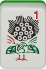
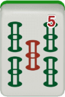
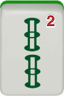
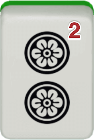
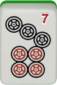
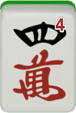
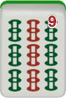
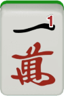
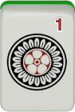
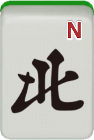

# 3.3 Complex shapes

The three basic types of tile blocks we have covered so far — groups (runs and sets), protoruns (side wait, closed wait, and edge wait), and pairs — form the basis of any standard mahjong hands.[^13] When a hand has some tiles that do not constitute any of these three shapes, we treat them as **floating tiles**. For example,  and  in the following hand are both floating tiles.

<fieldset class="mahjong-group">
<legend>Hand with floating tiles</legend>

</fieldset>

In addition to these basic blocks, we often come across complex shapes that are made up of two or more groups, protoruns, pairs, and floating tiles combined. It is useful to comprehend such com- plex shapes as they are rather than breaking them up into smaller parts. We will discuss three-tile complex shapes and four-tile complex shapes in turn.

## 3.3.1 Three-tile complex shapes

There are two kinds of three-tile complex shapes — double closed shape and protorun plus one shape.

### Double closed (ryankan) shape

When two closed-wait protoruns are combined, we have a **double closed** (ryankan) shape. There are five different patterns in each suit, as follows.

  
  
  

  
  
  

  
  
  

  
  
  

  
  
  

Each shape accepts as many as 2 kinds–8 tiles. For example,   accepts  (4 tiles) and  (4 tiles). This is twice as many as the  number of tiles an isolated closed-wait protorun can accept.

Sometimes a double closed shape is embedded within a tile block, making it difficult to detect it. For example, consider the following 1-away hand.

<fieldset class="mahjong-group">
<legend>Hand with a double closed shape</legend>

<figure class="caption2">
    
    <figcaption>Draw</figcaption>
</figure>

What would you discard?

</fieldset>

Before drawing , the hand was already in a very good shape. It was perfect 1-away, accepting any of        (6 kinds–19 tiles). The question is whether we should keep   and discard  instead.

Notice that, if we keep , we have a double closed shape    . This is because the block       can be split into    and   . If we keep  and discard , the hand is still 1-away from ready, accepting      (5 kinds–19 tiles). The benefit of discarding   to keep the double closed shape is that the hand can *always* be pinfu when it is ready. On the other hand, discarding   means that the hand may become a yaku-less hand when drawing  or .

Double closed shapes are particularly useful when a hand is rel- atively far from ready (2-away or worse). As a hand advances, however, its usefulness diminishes because this block requires three (not two) tiles even though it is not a complete group. Moreover, it will ultimately become a single closed-wait protorun when this block remains incomplete when the hand is ready. Therefore, we should not rely too much on a double closed shape. For example, consider the following two hands.

<figure class="caption2">
    
    <figcaption>Draw</figcaption>
</figure>

<figure class="caption2">
    
    <figcaption>Draw</figcaption>
</figure>

Both hands are 1-away from ready and both contain a double  closed shape in souzu (bamboos) tiles. Maintaining the double closed hape in these cases will not be ideal. It is true that, if the hand becomes  ready by drawing   or   first, each of the hands makes for  a good-wait ready hand. However, if the first hand becomes ready  by calling pon on  or the second hand becomes ready by drawing  or  first, they only make for a closed-wait ready hand.  

Therefore, when we draw a tile next to the head, creating a side-  wait protorun, we should keep it and break the double closed shape  instead. In the first example above, as we draw  that creates a side-wait  protorun   , we should keep it and discard the  instead.  

In the second example above, as we draw  that creates a side-wait  protorun   , we should keep it and discard   instead.

### Protorun plus one shape

As we saw with the first example in Section 3.2.8, we often come across a tile combination such as       that is made up with one  protorun plus one floating tile (      +  ). [^14] Depending on the type of protoruns, we can classify protorun plus one shapes into three types, as summarized in Table 3.2.

Table 3.2: Types of protorun plus one shapes

| Name        | Example                                                                 | Wait                                     | Acceptance       |
|-------------|-------------------------------------------------------------------------|------------------------------------------|------------------|
| side wait   |  | -  | 3 kinds–10 tiles |
| closed wait |  |                 | 2 kinds–6 tiles  |
| edge wait   |  |                | 2 kinds–6 tiles  |

A protorun plus one can accept two additional tiles that an iso- lated protorun cannot. This is because these blocks can now be a candidate for a set as well as for a run.

Breaking a protorun plus one can be inefficient. For example, if  we break a closed wait plus one shape into an isolated pair (i.e., discard    from      ), the tile acceptance decreases from 6 to 2; it  can accept only   (1 kind–2 tiles). Similarly, if we break it into an  isolated protorun (i.e., discard    from      ), the tile acceptance  decreases from 6 to 4; it can accept only   (1 kind–4 tiles). With this  in mind, consider the following hand.

<fieldset class="mahjong-group">
<legend>Protorun plus one</legend>

<figure class="caption2">
  
  <figcaption>Draw</figcaption>
</figure>

What would you discard?

</fieldset>

Discarding  or   to break the protorun plus one       is inefficient  here. Discarding   decreases tile acceptance by two, and discarding   decreases tile acceptance by four. Moreover, discarding   leaves three pairs in this hand, which should be avoided. Discarding    is much more efficient.

Sometimes we have to make a choice between multiple protorun plus one shapes, just like we did in examples in Section 3.2.8. Consider the following hand. What would you discard?

<fieldset class="mahjong-group">
<legend>Multiple protoruns plus one</legend>

What would you discard?

</fieldset>

There are two protorun plus one shapes in this hand:  and. We have to break one of the two into either an isolated Pair or an isolated protorun, because the other parts of this hand are more or less self-sufficient. Which one should we choose?

When choosing between which protoruns plus one to break, priority should be given to the weaker one. Since the side-wait protorun     is much stronger than the closed-wait protorun    , we should prioritize the latter and maintain      .  In other words, the  side-wait protorun     is so strong that we do not need to provide  a cover by maintaining the "plus one" tile,  .  On the other hand,  the closed-wait protorun     is weaker so we should cover it by  keeping another   as a back-up. You should thus discard  .

## 3.3.2 Four-tile complex shapes
Among several different kinds of four-tile complex shapes, we will focus on those that are made up of one group and one floating tile. There are three variants of this kind — stretched single, bulging float, and skipping.

### Stretched Single (Nobetan) Shape

A set of four consecutive tiles such as         is called a **stretched  single** (nobetan) shape. Stretched single shapes are very useful both  when a hand is ready and when a hand is 1-away or worse.

When a stretched single shape is in a ready hand, that part forms  the wait of the hand. For example, the following hand is ready, waiting  for    .

<fieldset class="mahjong-group">
<legend>Ready hand with a stretched single shape</legend>

</fieldset>

In a ready hand, the stretched single shape can be thought of as a candidate for the head ( or ) and a candidate for a run (    or   ‌). For example, if we win this hand on  , then  becomes the head, and    becomes a run. On the other hand, if we win this hand on , then  becomes the head, and   ‌ becomes a run.

Another important role that a stretched single shape can play is to work as a candidate for two runs. When a hand is 1-away or worse, we can count on a stretched single shape to produce two runs. For example, consider a stretched single shape    . If we draw , we will have a side-wait protorun   in addition to a complete run   . Similarly, if we draw , we will have a side-wait protorun   in addition to a complete run   . Moreover, if we draw  or , we will have a 3-way side-wait shape      (waiting for    ) or      (waiting for   ).

There are six patterns of stretched single shapes, from 1234 through 6789. Table 3.3 summarizes the tiles each shape can accept to produce various waits.

Table 3.3: Types of stretched single shapes

| Shape | 3-Way | 2-Way | 1-Way | Pair | Acceptance |
|-------|-------|--------|--------|------|------------|
|     |  |   |   |   | 6 kinds 20 tiles |
|     |  |    |  |   | 7 kinds 24 tiles |
|     |   |   |   |   | 8 kinds 28 tiles |
|     |   |   |   |   | 8 kinds 28 tiles |
|     |  |    |  |   | 7 kinds 24 tiles |
|     |  |   |   |   | 6 kinds 20 tiles |

As we can see, the middle two ones — 3456 and 4567 — are the most versatile. They can accept two different tiles to produce a 3-way wait (27 or 38), two different tiles to produce a 2-way side wait (45 or 56), and two different tiles to produce a 1-way wait (18 or 29 to produce a closed wait). The 3456 and 4567 shapes are the most valuable of all four-tile shapes, and we should not lightly break such shapes when a hand is far away from ready. With this in mind, consider the following 2-away hand.

<fieldset class="mahjong-group">
<legend>2-away hand with a stretched single shape</legend>

What would you discard?

</fieldset>

It is true that discarding ‌ or   would lead to the greatest tile acceptance (7 kinds–24 tiles) temporarily. However, doing so is too myopic. If we do that, all the remaining protoruns will be closed-wait or edge-wait ones. We should rather discard  to keep the 3456 shape, which we can expect to produce two side-wait protoruns later. The resulting tile acceptance (6 kinds–20 tiles) is not much smaller, either.

<fieldset class="redline">
  <legend>Four-tile complex shapes 1: nobetan</legend>

Try to keep a stretched single shape if a hand has one. In particular, 3456 and 4567 should be kept until the hand becomes ready or 1-away from ready.

</fieldset>

### Bulging float (nakabukure) shape

When we have a floating tile in the middle of a run (e.g.,     we have a **bulging float** (nakabukure) shape. Bulging float shapes are quite good at producing side-wait protoruns. Any bulging float shapes from 2334 through 6778 can accept four kinds of tiles to produce a side-wait protorun and a complete run. Take    , for example. It can produce a side-wait protorun and a complete run if we draw any of     ). With this in mind, consider the following 2-away hand.

<fieldset class="mahjong-group">
<legend>Hand with a bulging float shape</legend>

What would you discard?

</fieldset>

Discarding  to break the bulging float shape is not ideal. Although doing so increases tile acceptance temporarily, the hand will be filled with closed-wait protoruns. Alternatively, you should discard  to maintain the bulging float shape.

That being said, when this shape remains as is when a hand is ready, it does not make for a good wait. For example, consider the following ready hand.

<fieldset class="mahjong-group">
<legend>Ready hand with a bulging float shape</legend>

<figure class="caption2">
    
    <figcaption>Draw</figcaption>
</figure>

What would you discard?

</fieldset>

Discarding  to keep the bulging float shape     makes the wait of this hand pretty bad. It is waiting for , but we are already using two of it in the hand, leaving only two winning tiles. We should rather discard  to wait for .

<fieldset class="redline">
  <legend>Four-tile complex shapes 2: nakabukure</legend>

Try to keep a bulging float shape until a hand becomes 1-away.

</fieldset>

### Skipping shape

When we have a floating tile two tiles away from a run, we have a skipping shape. For example, in a shape ‌     ,‌ ,  is floating two tiles from a run    .  ‌ in a skipping shape is more valuable than isolated ‌, because it increases the kinds of tiles the hand can accept to produce a protorun or a 3-way side-wait shape. Table 3.4 summarizes all the skipping shapes and the tiles each shape can accept.

Table 3.4: Types of skipping shapes

<table>
  <thead>
    <tr>
      <th style="width: 200px;">Shape</th>
      <th style="width: 100px;">3-way</th>
      <th style="width: 100px;">2-way</th>
      <th style="width: 150px;">1-way</th>
      <th style="width: 100px;">Pair</th>
      <th style="width: 80px;">Acceptance</th>
    </tr>
  </thead>
  <tbody>
    <tr>
      <td></td>
      <td></td>
      <td></td>
      <td></td>
      <td></td>
      <td>4 kinds 14 tiles</td>
    </tr>
    <tr>
      <td></td>
      <td></td>
      <td></td>
      <td></td>
      <td></td>
      <td>5 kinds 18 tiles</td>
    </tr>
    <tr>
      <td></td>
      <td></td>
      <td></td>
      <td></td>
      <td></td>
      <td>6 kinds 22 tiles</td>
    </tr>
    <tr>
      <td></td>
      <td></td>
      <td></td>
      <td></td>
      <td></td>
      <td>6 kinds 22 tiles</td>
    </tr>
    <tr>
      <td></td>
      <td></td>
      <td></td>
      <td></td>
      <td></td>
      <td>5 kinds 18 tiles</td>
    </tr>
    <tr>
      <td></td>
      <td></td>
      <td></td>
      <td></td>
      <td></td>
      <td>5 kinds 18 tiles</td>
    </tr>
    <tr>
      <td></td>
      <td></td>
      <td></td>
      <td></td>
      <td></td>
      <td>6 kinds 22 tiles</td>
    </tr>
    <tr>
      <td></td>
      <td></td>
      <td></td>
      <td></td>
      <td></td>
      <td>6 kinds 22 tiles</td>
    </tr>
    <tr>
      <td></td>
      <td></td>
      <td></td>
      <td></td>
      <td></td>
      <td>5 kinds 18 tiles</td>
    </tr>
    <tr>
      <td></td>
      <td></td>
      <td></td>
      <td></td>
      <td></td>
      <td>4 kinds 14 tiles</td>
    </tr>
  </tbody>
</table>

Bearing in mind that   of    is more valuable than isolated ‌ , consider the following hand.

<fieldset class="mahjong-group">
<legend>Hand with a skipping shape</legend>

<figure class="caption2">
    
    <figcaption>Draw</figcaption>
</figure>

What would you discard?

</fieldset>

We should keep  and discard ‌ instead. This is because  is a part of a skipping shape    , but ‌ is an isolated floating tile.

As we can see in Table 3.4, skipping shapes with a terminal tile (1345 and 5679) are also valuable. The 1 of 1345 and the 9 of 5679 can accept more tiles than an isolated 2 or 8 (let alone than an isolated 1 or 9).

## Footnotes
[^13]: Standard hands are those with four groups and one head. Non-standard hands are chiitoitsu (Seven Pairs) and kokushi musou (Thirteen Orphans).

[^14]: Alternatively, we can think of these combinations as a pair plus one  + .