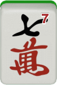
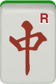
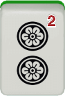
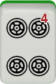
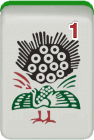
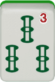
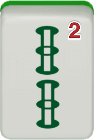
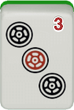
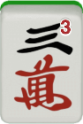
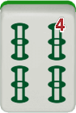

# 4.1 Finding a redundant tile

We all understand that a standard hand must have five blocks of tiles — four groups and one head — to win. The five-block method encourages us to be always conscious about five tile blocks in a hand. Consider the following hand. What would you discard and why?

To figure out which tile is the least useful in this hand, let’s divide
the hand into tile blocks, as follows.

<fieldset class="no-border">
<legend>(4.1)</legend>

    

      
      
    

    

    

      
      
    

    

    

      
      
      
      
    

    

    

      
      
      
    

    

    

      
      
      
    

    

</fieldset>

Notice that, although we do not know which block is going to be the head and which blocks are going to be four groups at the moment, the hand already has five tile blocks. This means that there is no need to increase or decrease the number of blocks from here.

Looking at each of the five blocks, the pair of , the protorun  , and the set of  are all self-sufficient; we keep them as they are. Our discard choice should thus be from the third or the fourth blocks,     or   . Let’s now compare these two closedwait blocks. While  is being useful within the block it belongs to, enabling the hand to accept , is completely redundant; the hand can accept  without having . Therefore, the ideal discard here is .

 

There are two key points to remember in applying the five-block method. First, we should not make any one of the five blocks “too weak.”[^3] In the current example, if we discard , the    block becomes an isolated closed-wait protorun, which is too weak compared with the other blocks. Likewise, if we discard , this block becomes a pair of . Since this hand already has two other pairs, having a third pair makes all the pairs in the hand too weak.

 

Second, each of the five tile blocks should ideally have three tiles. In the current example, the    block has exactly three tiles and so we should not choose a discard from this block. On the other hand, the     block currently has four tiles so we should discard one from this block to make this a three-tile block.

<fieldset class="redline">
  <legend>Five-block method</legend>
    Identify five tile blocks in a hand. Try to make sure:
     
    (1) there is no block that is too weak; and
     
    (2) each block has at most three tiles.

</fieldset>

Let’s see another example.

<fieldset class="no-border">

<figure class="caption2">
    
    <figcaption>Dora</figcaption>
</figure>

</fieldset>

We can easily see that there is one block in manzu (cracks), two blocks
in pinzu (dots), and a pair of white dragons, giving us four blocks.
This means that we need to have only one more block in souzu (bamboos).
Therefore, we divide the hand as follows.

<fieldset class="no-border">
<legend>(4.2)</legend>

    

      
      
      
    

    

    

      
      
      
    

    

    

      
      
    

    

    

      
      
      
      
    

    

    

      
      
    

    

</fieldset>

Since we should not create a block that is too weak, discarding ‌ or  is not an option. Notice that the block in souzu (bamboos) has four tiles. We should thus discard one from this block. In case the pair of white dragon later becomes a set, we should keep the pair of , leaving  or  as a discard candidate. Given that  has a higher chance of creating a side-wait protorun, we should discard . Then, none of the five blocks is too weak, and each block has at most three tiles.

 

In the two examples we saw above, you might have been able to identify the redundant tiles without really thinking too hard. If so, that was probably because you have implicitly and unconsciously applied the five-block method in your mind. The goal of this chapter is to train our mind further, so that it becomes our second nature to identify five tile blocks in a hand.

## Footnotes
[^3]: Basically, any block that is weaker than a side-wait protorun is a weak block.